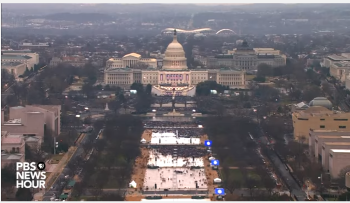
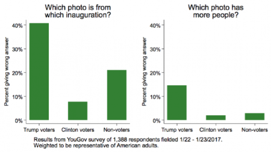

# alterfacts.org

A chronicle of newspeak and alternative facts from the Trump Administration

### What is this

This is an ongoing chronicle of falsehoods presented as fact by the Trump administration. It is not meant to be a comprehensive fact-checking analysis such as Snopes, but a record with links to relevant stories and analysis. The purpose is to ensure that the scope and severity of theses lies is documented as they happen, since over time, details tend to be forgotten and difficult to chronicle in context. The goal is to provide a reference as a constant reminder of the extreme and dangerous nature of the current administration.

### Please help

I need help maintaining this, both with updating, and organizing as the single-page layout will become unmanageable quickly. Anyone can contribute using Github. Please make changes and submit pull requests; open issues; or contact me directly if you want to be a privileged collaborator.

## Day 11 - January 30, 2017

### Cause of chaos at airports

7:20 AM - 30 Jan 2017

Trump denies his executive order caused airport chaos [Chicago Tribune](http://www.chicagotribune.com/news/nationworld/politics/ct-donald-trump-refugee-ban-airport-protests-20170130-story.html), [Crain's Chicago Business
](http://www.chicagobusiness.com/article/20170129/NEWS02/170129834/trump-travel-ban-leads-to-airport-chaos-protests)

>"Only 109 people out of 325,000 were detained and held for questioning. Big problems at airports were caused by Delta computer outage, protesters and the tears of Senator Schumer. Secretary Kelly said that all is going well with very few problems. MAKE AMERICA SAFE AGAIN!" 
>
> -- Donald Trump via [Twitter](https://twitter.com/realDonaldTrump/status/826041397232943104)

According to a Delta airlines representative, Delta's computers went down at 6:30 PM on Sunday, two days after Trump's executive order on immigration. 

Protests took place on Saturday and Sunday, long before this. Even [Breitbart](http://www.breitbart.com/big-government/2017/01/30/anti-trump-protests-block-airports-frustrate-travelers/) confirms timeline of protests.

Regarding the number detained, DHS reported that 109 were detained. They also reported that 375 were prevented from boarding aircraft departing for the US in the first place. It is unclear as of this writing how many are still detained, and how many were legal residents holding green cards.

### Victim blaming

> "It's a terrible reminder of why we must remain vigilant and why the President is taking steps to be proactive rather than reactive when it comes to our nation's safety and security"
>
> - Sean Spicer on Quebec attack via [The Intercept](https://pbs.twimg.com/media/C3cMwtUWMAAMNCs.jpg)

"The actual shooting suspect is 27-year-old Alexandre Bissonnette, a white French Canadian who is, by all appearances, a rabid anti-immigrant nationalist." - [The Intercept](https://theintercept.com/2017/01/30/suspect-in-quebec-mosque-attack-quickly-depicted-as-a-moroccan-muslim-hes-a-white-nationalist/) 

### Authoritarianism and war on media

> "Somebody with aptitude and conviction should buy the FAKE NEWS and failing @nytimes and either run it correctly or let it fold with dignity!" 
> 
>-- Donald Trump via [Twitter](https://twitter.com/realDonaldTrump/status/825690087857995776)

Koch network begins to [worry about authoritarianism](https://www.washingtonpost.com/news/powerpost/paloma/daily-202/2017/01/30/daily-202-fear-of-authoritarianism-pervades-koch-network-seminar-as-billionaire-donors-grapple-with-trump/588e4ed9e9b69b432bc7e09a/?hpid=hp_rhp-top-table-main_kochnetwork-635a%3Ahomepage%2Fstory&utm_term=.4521c3344cab)

## Day 9 - January 28, 2017

Steve Bannon is given a seat on the National Security Council via [New York Times](https://www.nytimes.com/2017/01/29/us/stephen-bannon-donald-trump-national-security-council.html?action=click&pgtype=Homepage&clickSource=story-heading&module=first-column-region&region=top-news&WT.nav=top-news&hp)

"... while downgrading the roles of the chairman of the Joint Chiefs of Staff and the director of national intelligence, who will now attend only when the council is considering issues in their direct areas of responsibilities."

## Day 7 - January 26, 2017

### Immigration ban "working out nicely"

After signing executive order "Protecting the Nation From Foreign Terrorist Entry Into the United States" the previous day, Trump told reporters that ["It's working out very nicely. You see it at the airports. You see it all over."](http://www.cnn.com/2017/01/28/politics/donald-trump-travel-ban/)  
Granted, it is possible that, rather than a lie, this is a highly idiosyncratic interpretation of ["working out very nicely."](http://www.chicagobusiness.com/article/20170129/NEWS02/170129834/trump-travel-ban-leads-to-airport-chaos-protests)

### Authoritarianism and war on media

> “The media should be embarrassed and humiliated and keep its mouth shut and just listen for a while,” Mr. Bannon said in an interview on Wednesday.
>
> “I want you to quote this,” Mr. Bannon added. “The media here is the opposition party. They don’t understand this country. They still do not understand why Donald Trump is the president of the United States.
>
> Steve Bannon via [New York Times](https://www.nytimes.com/2017/01/26/business/media/stephen-bannon-trump-news-media.html)

## Day 6 - January 25, 2017

### First Interview as President

Complete transcript on [Washington Post](https://www.washingtonpost.com/news/the-fix/wp/2017/01/26/donald-trumps-brazen-first-interview-as-president-annotated/?hpid=hp_rhp-top-table-main_pp-trumptv-330am%3Ahomepage%2Fstory&utm_term=.48f7953d0ad2)

*Note that while I've excepted a few particularly stunning portions of the interview, the entire text should be read to fully appreciate the state of mind of the President.*

> DAVID MUIR: So, they'll [Mexico] pay us back?

> PRESIDENT TRUMP: Yeah, absolutely, 100 percent.

*Response from Mexico*

> "Mexico does not believe in walls. I've said time again; Mexico will not pay for any wall" - Enrique Pena Nieto via [Twitter video](https://twitter.com/EPN/status/824447050066468865)

*Pena Nieto cancelled a planned meeting coincident with this statement.*

> PRESIDENT TRUMP: You have people that are registered who are dead, who are illegals, who are in two states. You have people registered in two states. They're registered in a New York and a New Jersey. They vote twice. There are millions of votes, in my opinion.

*There is no evidence that duplicate registrations manifest as duplicate votes, ever. See "voter fraud" below.*

> DAVID MUIR: What you have presented so far has been debunked. It's been called false.

> PRESIDENT TRUMP: No, it hasn't. Take a look at the Pew reports.

> DAVID MUIR: I called the author of the Pew report last night. And he told me that they found no evidence of voter fraud.

> PRESIDENT TRUMP: Really? Then why did he write the report?

> DAVID MUIR: He said no evidence of voter fraud.

> PRESIDENT TRUMP: Excuse me, then why did he write the report?

> PRESIDENT TRUMP: I will say this, of those votes cast, none of 'em come to me. None of 'em come to me. They would all be for the other side. None of 'em come to me.

*talking about speech to CIA*

> PRESIDENT TRUMP: That speech was a home run. That speech, if you look at Fox, okay, I'll mention you — we see what Fox said. They said it was one of the great speeches. They showed the people> applauding and screaming and — and they were all CIA. There was — somebody was asking Sean — “Well, were they Trump people that were put--" we don't have Trump people. They were CIA people.

> PRESIDENT TRUMP: I then spoke to the crowd. I got a standing ovation. In fact, they said it was the biggest standing ovation since Peyton Manning had won the Super Bowl and they said it was equal. I got a standing ovation. It lasted for a long period of time. What you do is take — take out your tape — you probably ran it live. I know when I do good speeches. I know when I do bad speeches. That speech was a total home run. They loved it. I could've..

*talking about inauguration*

> PRESIDENT TRUMP: In terms of a total audience including television and everything else that you have we had supposedly the biggest crowd in history. 

> PRESIDENT TRUMP: Well, we should've kept the oil when we got out [of Iraq]. And, you know, it's very interesting, had we taken the oil, you wouldn't have ISIS because they fuel themselves with the oil. That's where they got the money. They got the money from leaving — when we left, we left Iraq, which wasn't a government. It's not a government now.

> DAVID MUIR: You've heard the critics who say **that would break all international law, taking the oil.** But I wanna get to the words …

> PRESIDENT TRUMP: Wait, wait, can you believe that? **Who are the critics who say that? Fools.**

### Same Interview, Additional Lies

In the same interview, Trump also claimed that 2 murders occurred in Chicago during President Obama's farewell speech. [This is false](http://www.chicagotribune.com/news/local/breaking/ct-trump-chicago-violence-abc-interview-met-20170126-story.html)

### Voter Fraud

>"I will be asking for a major investigation into VOTER FRAUD, including those registered to vote in two states, those who are illegal and.." -- Donald Trump via [Twitter](https://twitter.com/realDonaldTrump/status/824227824903090176)

#### the truth

Being registered in two states is not voter fraud. It is extremely common, because when people move, there is no automatic mechanism to un-register them from their prior place of registration. Voter rolls are purged periodically, but no evidence exists of any widespread double-voting because of duplicate registrations.

"Why voters are removed from the rolls explained" - via [NPR](http://www.npr.org/2016/04/20/474990269/why-voters-are-removed-from-the-rolls-explained)

> But if the voter doesn't show up for two federal elections in a row, his name can legitimately be removed 
> from the rolls. A name can also be removed if election officials verify that the individual has died, moved
> to another jurisdiction or is not allowed to vote for some other reason.

#### steve bannon is registered in two places, and one of them may be illegal

"[Trump's senior advisor] Steve Bannon is registered to vote in two states" - via [The Guardian](https://www.theguardian.com/us-news/2017/jan/25/steve-bannon-voter-registration-trump-election-voter-fraud)

"Donald Trump adviser Stephen Bannon is registered to vote in two states – which US President wrongly calls voter fraud" -- via [The Independent](http://www.independent.co.uk/news/world/americas/donald-trump-steve-bannon-white-house-chief-strategy-adviser-registered-vote-two-states-voter-fraud-a7546146.html)

> Stephen Bannon registered to vote in New York prior to the election, but he still is registered to vote in
> Florida. He cast only one ballot in New York. 
 
> Florida state records show that Mr Bannon is registered at the home of a former Breitbart colleague, Andy 
> Badolato. It remains unclear whether Mr Bannon actually lived at the property – a requirement of Florida 
> registration rules – at the time of his registration. 

### Dow Jones hits 20,000

> "The Trump Effect" - Kellyanne Conway vis [Twitter](https://twitter.com/KellyannePolls/status/824269356582453250)

... retweeting 

> "President #Trump's early policy follow through propels Dow to 20K #Dow20K #WallStreet  http://fxn.ws/2j4HNnu" - Fox Business via [Twitter](https://twitter.com/FoxBusiness/status/824263996631027713)

This isn't really a big lie, but certainly unprovable, and correlation does not imply causation. Nor do short term dow jones fluctuations mean much of anything. Suggest we revisit this in a year or two.

For reference, when Obama took office on January 20, 2009, the Dow closed at 7,949.09. On January 20, 2017, it closed at 19,827.25.

[Last 10 years of DJIA](http://www.macrotrends.net/1358/dow-jones-industrial-average-last-10-years)

## Day 5 - January 24, 2017

> “I think there have been studies, there was one that came out of Pew in 2008 that showed 14 percent of people who have voted were not citizens. There are other studies that were presented to him.”

–- Sean Spicer, news briefing, Jan. 24, 2017 [Washington Post](https://www.washingtonpost.com/news/fact-checker/wp/2017/01/24/recidivism-watch-spicer-uses-repeatedly-debunked-citations-for-trumps-voter-fraud-claims/?hpid=hp_rhp-top-table-main_no-name%3Ahomepage%2Fstory&utm_term=.afbeb91e02b6)

#### the truth

> "We found millions of out of date registration records due to people moving or dying, but found no evidence that voter fraud resulted." - David Becker, Executive Director, The Center for Election Innovation & Research via [Twitter](https://twitter.com/beckerdavidj/status/803301967875321857?ref_src=twsrc%5Etfw)

> "As I've noted before, voting integrity better in this election than ever before. Zero evidence of fraud."
David Becker via [Twitter](https://twitter.com/beckerdavidj/status/823898627806523392)

#### other events of note

"EPA and USDA media blackout" via [The Hill](http://thehill.com/policy/energy-environment/315876-trump-bans-epa-employees-from-giving-social-media-updates)

## Day 3 - January 22, 2017

### ALTERNATE FACTS ARE BORN

> "You're saying it's a falsehood. And they're giving -- Sean Spicer, our press secretary -- gave alternative facts" - Kellyanne Conway, ["Meet The Press"](http://www.nbcnews.com/meet-the-press/video/conway-press-secretary-gave-alternative-facts-860142147643)

## Day 2 - January 21, 2017

> "Had a great meeting at CIA Headquarters yesterday, packed house, paid great respect to Wall, long standing ovations, amazing people. WIN " - Donald J. Trump via [twitter](https://twitter.com/realDonaldTrump/status/823146987117772800)

> "Wow, television ratings just out: 31 million people watched the Inauguration, 11 million more than the very good ratings from 4 years ago!" - Donald J. Trump via [twitter](https://twitter.com/realDonaldTrump/status/823151124815507460)

> "But, we had a massive field of people . You saw that. Packed. I get up this morning. I turn on one of the networks and they show an empty field. I say: “Wait a minute. I made a speech . I looked out. The field was…. It looked like a million, a million and a half people."
> "We had 250,000 people literally around, you know, the little bowl that we constructed. That was 250,000 people. The rest of the 20 block area all the way back to the Washington Monument was packed. So we caught them. And we caught them in a beauty. And I think they’re going to pay a big price."

-- from [full speech](http://www.mirror.co.uk/news/world-news/watch-donald-trump-give-first-9670723)

> “This was the largest audience to witness an inauguration. Period!"
> "We know that 420,000 people used the D.C. Metro public transit yesterday, which actually compares to 317,000 that used it for President Obama's last inaugural." - Sean Spicer, transcript from [Politico](http://www.politico.com/story/2017/01/transcript-press-secretary-sean-spicer-media-233979)

#### the truth

In 2009, Nielsen recorded 38 million viewers for Obama's inauguration and 31 million for Trump's. Source: [Nielsen 2009](http://www.nielsen.com/us/en/insights/news/2009/nearly-378-million-watch-president-obamas-oath-and-speech.html) and [Nielsen 2013](http://www.nielsen.com/us/en/insights/news/2017/nearly-31-million-americans-watch-president-donald-trumps-inauguration.html) watching Trump.

Estimates for Obama's first inauguration were 1.8 million, and for Trump, approximately 250,000 (TODO - multiple sources)

As of 11 AM, 193,000 people had ridden metro on January 20, 2017, vs. 317,000 in 2013. Source: [WMATA](https://twitter.com/wmata/status/822482330346487810?ref_src=twsrc%5Etfw)

Total ridership in 2017 was 570,000. Total ridership in 2013 was 782,000. Source: [Politifact](http://www.politifact.com/truth-o-meter/statements/2017/jan/21/sean-spicer/trump-had-biggest-inaugural-crowd-ever-metrics-don/)

Time lapse video of Trump's inauguration: 

Trump supporters claim that the picture of Obama's inauguration has fewer people than Trump's, via [The Washington Post](https://www.washingtonpost.com/news/monkey-cage/wp/2017/01/25/we-asked-people-which-inauguration-crowd-was-bigger-heres-what-they-said/?utm_term=.93d40656eae0&wpisrc=nl_most&wpmm=1
)

TODO 

* add Side by side comparison picture
* add Statement from CNN authenticating the time of the picture
* add CBS statement that Trump filled the CIA audience with shills

## Day 1 - January 20, 2017

### "January 20th 2017, will be remembered as the day the people became the rulers of this nation again." - Donald J. Trump via [twitter](https://twitter.com/realDonaldTrump/status/822502270503972872)
